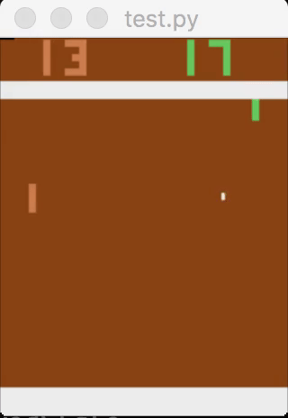
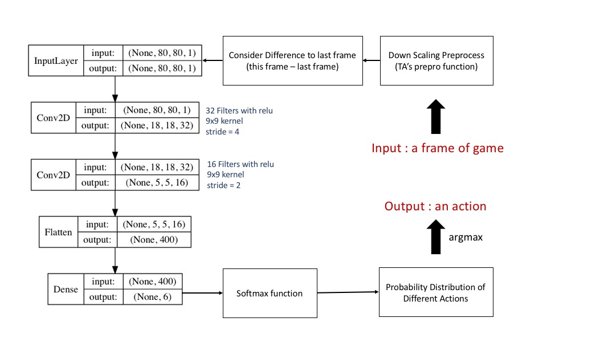
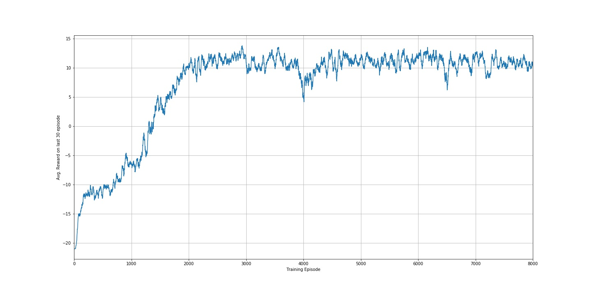

# Policy Gradient (PG) & Actor-Critic - Simple Keras Implementation

## Description

This is an implementation of Policy Gradient & Actor-Critic playing Pong/Cartpole from OpenAI's gym.

Here's a quick demo of the agent trained by PG playing Pong.

 

With Keras, I've tried my best to implement deep reinforcement learning algorithm without using complicated tensor/session operation. In this project, the following techniques have been implemented:

- Policy Gradient
- Actor-Critic

Here's the architecture overview of PG model playing Pong in this work:

 

And the learning curve:

 

The project is derived from an assignment of the course [Applied Deep Learning](https://www.csie.ntu.edu.tw/~yvchen/f106-adl/) I took during 2017 fall, all works are currrently not in maintenance. (But I'll try my best to help if there's question)

## Requirements

The follow packages are required, you can install them with `pip3 install [package]`

- opencv-python
- gym
- gym[atari]
- tensorflow
- keras
- scipy	

## Setup
- Training an agent to play Pong
	
    To train an agent playing Pong with PG, simply run

	`python3 main.py --train_pg`

	You can train the agent to play games different from Pong by using argument `--env_name [Atari Game Env Name]`

	But you should modify some part of all codes in order to fit the given environment.

    To modify any parameters of model/training progress, please modify [agent_pg.py](agent_dir/agent_pg.py).

- Test the agent's performance on Pong
     
     By running the following command, you can get agent's average score in 30 episode
     
     `python3 test.py --test_pg`
     
     Testing can be performed with the pretrained model training by default or with the model you trained by adding argument `--test_pg_model_path [your model path]`
     
     To visualize the gaming progress, add `--do_render` to the end. You can also save it to vedio with `--video_dir [path to save]` (set smaller testing episode before doing so)

- Playing Cartpole or other Atari games

	Agents playing Cartpole with Policy Gradient or Actor-Critic is also in [agent_dir/](agent_dir/), run (modify) them in order to play Cartpole (other games). Testing is not supported, but can be done easily via implementing functions declared in [agent.py](agent_dir/agent.py).

## References
- [Pong solver by mkturkcan](https://github.com/mkturkcan/Keras-Pong)
- [Actor-Critic tutorial by morvanzhou](https://github.com/MorvanZhou/Reinforcement-learning-with-tensorflow/)
- Framework provided by TAs of the course.